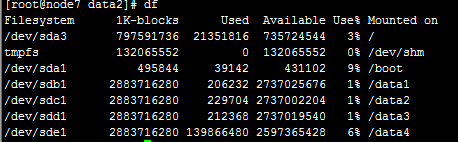
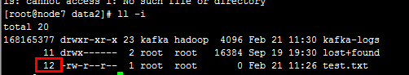
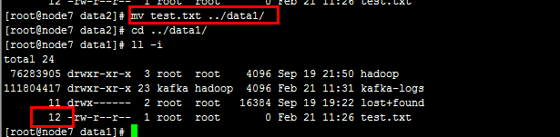

title: Linux mv 操作是否新创建空间
date: 2017-02-24 17:36:53
tags:编程开发
--

# Linux mv 操作的探讨 #
## 前期内容 ##
Linux 操作过程中，可以通过 `ll -i ` 查看inode
> inode详解
linux上的inode编号是索引节点的编号。理解inode，要从文件储存说起。
　　文件储存在硬盘上，硬盘的最小存储单位叫做"扇区"（Sector）。每个扇区储存512字节（相当于0.5KB）。
　　操作系统读取硬盘的时候，不会一个个扇区地读取，这样效率太低，而是一次性连续读取多个扇区，即一次性读取一个"块"（block）。这种由多个扇区组成的"块"，是文件存取的最小单位。"块"的大小，最常见的是4KB，即连续八个 sector组成一个 block。
　　文件数据都储存在"块"中，那么很显然，还必须找到一个地方储存文件的元信息，比如文件的创建者、文件的创建日期、文件的大小等等。这种储存文件元信息的区域就叫做inode，中文译名为"索引节点"。
　　每个inode都有一个号码，操作系统用inode号码来识别不同的文件。这里值得重复一遍，Unix/Linux系统内部不使用文件名，而使用inode号码来识别文件。对于系统来说，文件名只是inode号码便于识别的别称或者绰号。表面上，用户通过文件名，打开文件。实际上，系统内部这个过程分成三步：首先，系统找到这个文件名对应的inode号码；其次，通过inode号码，获取inode信息；最后，根据inode信息，找到文件数据所在的block，读出数据。

## 结论 ##
mv 在操作过程中不会改变文件在磁盘上的位置。

## 测试 ##
> 1 查看当前Linux中磁盘情况	
``` Linux
df
```
显示如图： 


> 2 查看需要`mv`的文件的inode
``` Linux
ll -i
```
显示如图：


> 3 移动并查看移动后的文件的inode
显示如图

